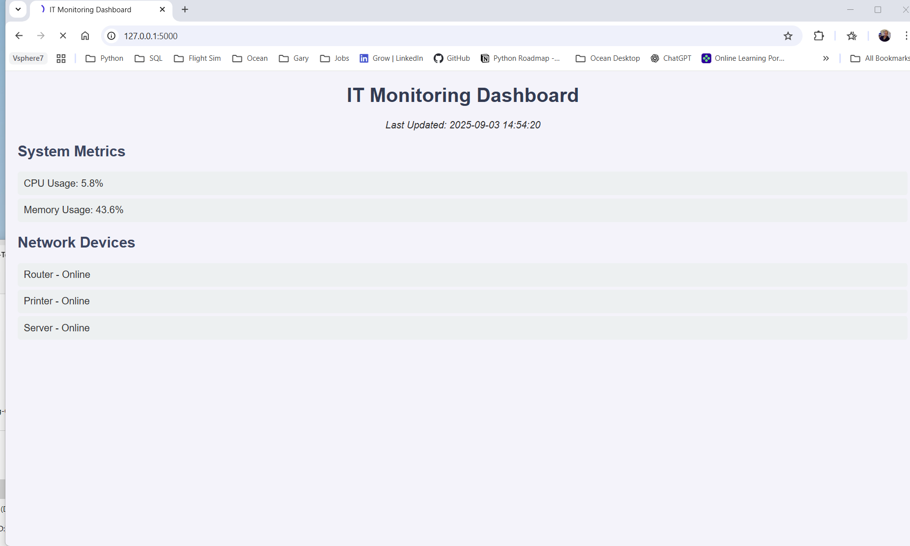
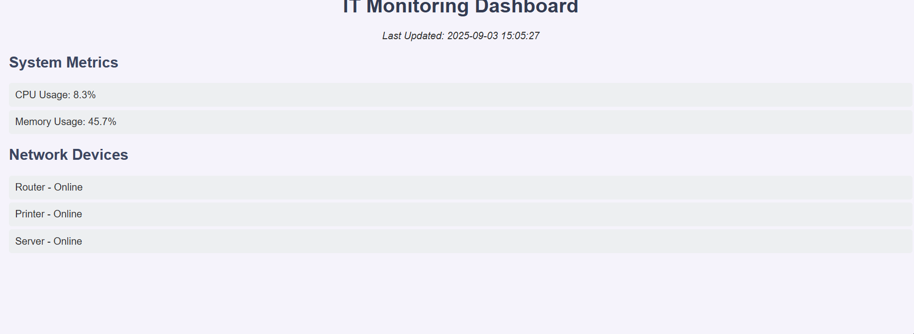

# ANM IT Support Tools

**A collection of IT automation scripts, troubleshooting guides, and a monitoring dashboard for 2nd/3rd line IT support.**

## Overview
This repository demonstrates practical IT support skills, including:

- Active Directory and Office 365 automation
- Network and system monitoring
- Troubleshooting guides for common IT issues
- A web-based dashboard for monitoring servers and workstations

## Skills Demonstrated
- PowerShell & Python scripting
- IT infrastructure monitoring
- Troubleshooting and problem-solving
- Flask web dashboard development
- End-user documentation

## Project Structure

- **Scripts/** – Automation scripts for AD, Office 365, and network checks  
- **Dashboard/** – Flask-based monitoring dashboard  
- **Troubleshooting-Guides/** – Step-by-step Markdown guides  
- **README.md** – Project overview and instructions

## How to Use

1. Clone the repository:
```bash
git clone https://github.com/Garytech64/Anm---IT--Support-Tools.git
cd Anm---IT--Support-Tools


---

## **Step 6: Screenshots / GIFs**

```markdown
## Screenshots / Demo

**Dashboard View:**  


**Script Output Example:**  ## 🔧 Scripts & Tools

This project includes helpful automation scripts for IT Support tasks.

### 1. Printer Diagnostics (PowerShell)
Checks installed printers and the Print Spooler service status.

```powershell
cd Scripts
.\printer_diagnostics.ps1


**Optional Demo GIF:**  


## License
MIT License


